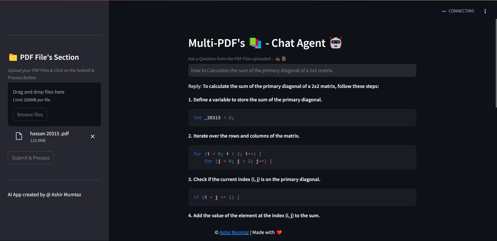

# Introducing MultiPDF: Your Blazing-Fast, Open-Source PDF Companion

Experience the Power of AI, Accelerated

MultiPDF is a revolutionary AI-powered app that lets you chat directly with your PDFs. Powered by the cutting-edge Groq AI accelerator and open-source language models, MultiPDF delivers lightning-fast responses and exceptional accuracy.   

# Key Features:

**Instantaneous Insights:** Get real-time answers to your PDF-related questions. 
**Contextual Understanding:** Our AI grasps the context of your queries, providing relevant and precise information. 
**Efficient Search:** Quickly find specific information within your documents. 
**Open-Source Power:** Built on open-source technologies, ensuring transparency and community-driven innovation. 
**Groq Acceleration:** Experience unparalleled speed and performance with Groq's advanced hardware.   
Revolutionize Your PDF Workflow

Simplify your document interactions with MultiPDF. Say goodbye to time-consuming searches and hello to efficient, intelligent PDF exploration.

## 🌟Requirements

- **Streamlit** : A Python library for building web applications with interactive elements.
- **LangChain-Groq** : It is an integration that accelerates large language model (LLM) applications using Groq's AI hardware. It enables faster, more efficient, and cost-effective LLMs for real-time applications like chatbots, document analysis, and content generation.
- **python-dotenv** : A library for loading environment variables from a `.env` file. This is commonly used to store configuration settings, API keys, and other sensitive information outside of your code.
- **langchain** : A custom library for natural language processing tasks, including conversational retrieval, text splitting, embeddings, vector stores, chat models, and memory.
- **PyPDF2** : PyPDF2 is a library for reading and manipulating PDF files in Python. It can be used to merge, split, and modify PDFs. In the context of a multipdf chatbot, PyPDF2 could be used to handle the manipulation and generation of PDF files based on user input or responses.
- **faiss-cpu** : FAISS (Facebook AI Similarity Search) is a library developed by Facebook for efficient similarity search, Machine Learning Embeddings,Information Retrieval, content-based filtering and clustering of dense vectors.
- **langchain_commuinty** : provides third-party integrations to extend LangChain's capabilities, including vector stores, retrievers, LLM providers, and toolkits.

## Project WorkFlow

## Preview

